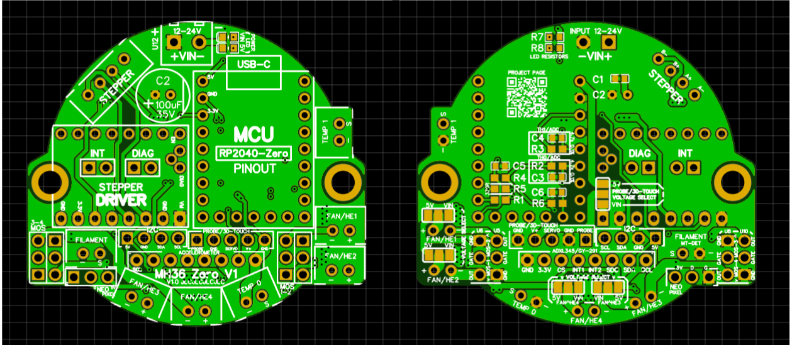

# MH36-Zero V1.0

**Modular toolhead board for Waveshare RP2040-Zero and compatible modules**


Also on [OSHWLab](https://oshwlab.com/kwankiu/rp2040-zero-toolhead)

MH36-Zero is a compact, open-source toolhead board designed for Voron, Rat Rig, and other Klipper-based 3D printers. Built around the Waveshare RP2040-Zero, it is minimalist yet feature-complete: 4 independent fan/heater channels, selectable voltage, StepStick driver socket, ADXL345 breakout, filament detection, probe support, Neopixel, and I2C expansion.

The board is designed to be **cheap and easy to build** — only basic SMD passives are required, and it reuses parts you likely already have (RP2040-Zero, TMC driver, ADXL breakout, NMOS modules, etc.).

## Key Features / Compatibility

- Modular and reusable parts (drawer-friendly)
- Waveshare RP2040-Zero socket
  - Supports RP2040-Zero/Tiny, RP2350-Zero, and pin-compatible modules
  - Cloned RP2040-Zero cost less than $2 (Not tested for reliability, Waveshare board is **recommended**)
- StepStick driver module socket
  - Supported Drivers:
    - **UART Mode:** TMC2209 (recommended), TMC2208, TMC2225, TMC2226, TMC2240, GC6609
    - **Static Mode**:* A4988, DRV8825, LV8729
    - **SPI Mode:** Not Supported
  - DIAG Jumper for StallGuard on supported TMC drivers
- 4× independent FAN/HE channels with NMOS headers (GND-GATE-OUT)
  - MOS_VSEL jumper: 5V or VIN selectable
  - Removable NMOS modules (6-pin header)
  - NMOS modules: 40A NMOS module (HYG038N03) from aliexpress/taobao, Mellow Fly VS3622DE (dual-channel), etc.
  - High-current capable (using KF128-2.54-2P connectors, default XH2.54-2P is 3A max)
- ADXL345 (GY-291) breakout socket (SPI + INT)
  - Support I2C and SPI
  - INT1 is connected to GPIO 13 (shared with Probe)
- NTC/PT1000 temperature sensors (2 channels)
  - Support NTC 100K and PT1000 (4.7K pull-up resistor, PT100 not supported)
- Neopixel header
- Probe / 3D-Touch header with servo support
- Filament Detect header (configurable as endstop for homing)
- I2C expansion header (support sensors like AHT20, BME280, LDC1612, Eddy, etc)
- Power input: 12–24V screw terminal (3.81 mm)
- Optional VIN & 5V power LEDs
- M3 mounting holes (43.85 mm diagonal spacing)
  - Fits 36 mm pancake motors, compatible with EBB36 mount
  - Mount: Mini Stealthburner, Anthead, A4T, DragonBurner, G2 and similar toolheads
- Board size: 50.8 × 45.8 mm
- Firmware: Klipper (tested with RP2040-Zero USB connection)

***A4988** requires a small hardware modification to reach **1/16**: you must **short MS1 & MS2 pins to MS3** on the driver/header. **DRV8825** and **LV8729** (and **A4988** after the mod) can switch between **Full Step** (UART pin LOW) and **1/16** (UART pin HIGH) via firmware.

## Pinout & Wiring

**TO BE ADDED**


## PCB
The V1.0 PCB is a **4-layer PCB** designed using EasyEDA and is available on OSHWLab, you may also use the exported gerber file in this repo

For JLCPCB, upload the gerber file, and leave the PCB specifications as default
- Cost (5 pcs): $7 (sometimes $2 with offer/coupon)

However, you may want to ensure the following specifications:
- 4-layer PCB
- 1.6mm PCB thickness
- 1oz copper (0.5oz inner)
- Plugged (Via Covering)

Notes: make sure to choose `Order Number(Specify Position)` for JLCPCB, or remove the `JLCJLCJLCJLC` silk label from the PCB File before ordering

PCB V1.0 layout:


## BOM
### Mandatory Components
| Qty | Component                                      | Package / Type              | Notes                                                                                   |
|-----|------------------------------------------------|-----------------------------|-----------------------------------------------------------------------------------------|
| 5   | 100 nF ceramic capacitor                       | 0603                        |                                                                                         |
| 1   | 100 µF (35V) capacitor                         | Through-hole                | 35V or higher, electrolytic or solid, 6.3 mm or 8 mm diameter                           |
| 2   | 2.2 kΩ resistor                                | 0603                        |                                                                                         |
| 2   | 4.7 kΩ (±0.1%) resistor                        | 0603                        | **0.1% tolerance strongly recommended** for accurate temperature readings               |
| 1   | 100 Ω resistor                                 | 0603                        | UART                                                                                    |
| 1   | 330 Ω resistor                                 | 0603                        | or 470 Ω; can be omitted if your Neopixel already includes a 470 Ω series resistor      |
| 1   | 3.81 mm 2-pin screw terminal                   | KF128-3.81-2P or equivalent | For 12-24V Power Input                                                                  |
| 1   | Waveshare RP2040-Zero                          | —                           | or compatible module                                                                    |
| 1   | StepStick driver module                        | —                           | TMC2209, GC6609, A4988, etc.                                                            |
| 1   | NMOS fan/heater driver module                  | —                           | 4× HYG038N03 module **or** 2× Mellow FLY Fan MOS or similar                             |
| —   | 2.54 mm male headers                           | 2.54 mm                     | Various pin counts as needed                                                            |
| —   | 2.54 mm female headers                         | 2.54 mm                     | For RP2040-Zero, StepStick, NMOS 6-pin, ADXL 8-pin                                      |
| 7   | 2.54 mm XH 2-pin connectors                    | XH 2.54 mm                  | Can swap 1–3 with KF128-2.54-2P for FAN/HEATER headers                                  |
| 1   | 2.54 mm XH 4-pin connector                     | XH 2.54 mm                  | Stepper motor connector                                                                 |

### Optional Components
| Qty | Component                                      | Package / Type              | Notes                                                                            |
|-----|------------------------------------------------|-----------------------------|----------------------------------------------------------------------------------|
| 2   | 0603 LED                                       | 0603                        | VIN & 5V power indicators                                                        |
| 1   | 10 kΩ resistor                                 | 0603                        | Current-limiting resistor for VIN LED, use 22 kΩ or higher if too bright         |
| 1   | 2.2 kΩ resistor                                | 0603                        | Current-limiting resistor for 5V LED                                             |
| 1   | ADXL345 module                                 | GY-291 or pin-match         | For input shaping, bed leveling, probing, X/Y homing                             |
| 1   | NTC 100K thermistor                            | Through-hole                | Chamber temperature monitoring                                                   |
| 2   | 2.54 mm jumper / shunt                         | 2.54 mm                     | For enabling INT and DIAG pins (if/when needed)                                  |

## Assembly Guide

Follow these steps in order. Start with a clean workspace, good lighting, and appropriate soldering tools (fine-tip iron ~350–380°C for SMD, flux, solder wick for mistakes). Use leaded solder for easier SMD work if possible.

1. **Solder bottom-side SMD passives**  
   Populate and solder all 0603 components on the bottom side:  
   - 5 × 100 nF ceramic capacitors on C1, C3, C4, C5, C6
   - 2 × 4.7 kΩ **0.1%** resistors on R2 and R3
   - 2 × 2.2 kΩ resistors on R1 and R4
   - 1 × 330 Ω resistor on R5 (or 470 Ω; skip if your Neopixel chain already has series resistance)
   - 1 × 100 Ω resistor on R6
   - Optional: LED current-limiting resistors (10 kΩ for VIN LED on R7, 2.2 kΩ for 5V LED on R8) if installing power indicators

   **Tip**: Use plenty of flux, tin one pad first, place component with tweezers, then solder the second pad. Reflow with hot air if available for cleaner results.

   *(Add photo here: close-up of soldered 0603 passives on bottom side)*

2. **Configure voltage-select solder jumpers (bottom side)**
   There are **five** sets of 3-pin solder jumper pads for voltage selection:
   - Probe / 3D Touch
   - FAN/HE1
   - FAN/HE2
   - FAN/HE3
   - FAN/HE4

   Each set has three pads in a row (or sometimes in a different orientation like vertical), with the **center pad** being the common pin that needs to connect to your chosen voltage.

   - **Solder a bridge** between the **center pad** and the pad labeled for your desired operating voltage (check specific jumper's orientation and refer to silkscreen labels on the PCB).
   - Use a small amount of solder to create a clean bridge — avoid excess that could short to adjacent pads.

   **Examples**:  
   - For 24V operation (12-24V depending on your main power source) → bridge center to the "VIN" labeled pad
   - For 5V operation → bridge center to the "5V" labeled pad

   **Caution**: Double-check your target voltage — wrong setting can damage fans, heaters, or probes!

   *(Add photo or diagram here: zoomed-in view of solder jumper pads before/after bridging)*

3. **Solder top-side through-hole and larger components**
   - 2.54 mm male and female headers
   - 3.81 mm 2-pin screw terminal (KF128 style or equivalent)
   - 100 µF 35 V capacitor on C2 — **observe polarity!** (negative stripe toward GND)
   - All XH 2-pin (or KF128 style) and 4-pin connectors
   - Optional: 0603 Power indicator LEDs (make sure R7 and R8 resistors are soldered at the bottom)

4. **Configure optional feature jumpers (top side)**  
   - Short the INT and/or DIAG jumper pads with 2.54 mm jumper shunts **only if** you need those features enabled.  
   - Leave open otherwise to avoid unnecessary pull-ups or conflicts.

5. **Install plug-in modules**  
   Insert and solder (if castellated/through-hole) or just plug (if socketed):  
   - RP2040-Zero module
     - Align the pins precisely — check orientation!
   - Stepper driver module (TMC2209, etc)
     - Align the pins precisely — check orientation!
   - NMOS modules for fan/heater
     - For 3-pin NMOS modules (e.g., HYG038N03 or similar): Pay close attention to orientation and pin order
     - For 6-pin modules (e.g., Mellow FLY Fan MOS or equivalents): These are often symmetric and can be installed in **either orientation** — confirm with your specific module's pinout if it has any asymmetry.
   - **Optional: Accelerometer module** (GY-291 ADXL345 or any pin-compatible breakout)  
     Plug into the dedicated 8-pin header.  
     **Important compatibility check**: When viewing the board from the top side (components facing you), the **rightmost pin** of the 8-pin header (the first pin from the right) must connect to **GND** on your accelerometer module.  
     - If your module has **GND** as its rightmost pin → compatible and safe to plug in.  
     - If your module has **VCC** or **3.3V** as the rightmost pin → **incompatible** — do **not** insert it, as this will short power directly to ground and likely damage the module or board.  

   *(Add photo here: fully populated board with modules installed)*

6. **Optional: GND enhancement for high-current / sustained loads**  
   For applications with **very high sustained current draw** (especially through the stepper driver, FAN/HE1, and FAN/HE2 outputs), you can further improve the ground return path and potentially reduce localized heating:

   - Solder a thick wire (**≥18 AWG**, ideally 16–14 AWG if space allows) between one of the following pairs:
     - The two GND pins on the TMC/StepStick module socket (top side), **or**
     - The corresponding GND pads on the **bottom** of the PCB (even better).

   This creates a low-resistance bridge across the ground plane, helping distribute return current more evenly between the left and right sections of the board.

   **Note**: This enhancement was originally added as a precaution for a routing limitation in early/pre-V1.0 board revisions, where a narrow ground path between the left and right ground planes could theoretically force most current through the TMC module itself (acting as a lower-resistance path). The final **V1.0 PCB layout** fully resolves this routing limitation with improved ground plane connectivity, so this modification is **not required** for production boards. However, it remains a useful low-risk mod for extreme use cases or if you notice driver/module warmth during testing.

   *(Suggested: Add close-up photo here – showing the thick GND wire soldered between TMC GND pins or bottom pads, before/after comparison if possible)*

## Klipper Configuration

See `firmware/klipper_config/MH36Zero.cfg` in this repo for pin example.

```ini
## Toolhead Board
##--------------------------------------------------------------------
[mcu thb]
## For USB
##	Obtain definition by "ls /dev/serial/by-id/*" then unplug to verify
serial: /dev/serial/by-id/{REPLACE WITH YOUR SERIAL}
restart_method: command

#######
# MCU #
#######

# MH36 Zero
[include MH36Zero.cfg]
```
See `firmware/klipper_config/example.cfg` in this repo for detailed example.

## Safety & Warnings

- No overcurrent/short-circuit protection on VIN — use fused/current-limited PSU, never plug/unplug wires live.
- No reverse polarity protection — double-check VIN + – wiring before power-up (reverse may damage USB host via GND back door).
- Hand-assembly **required** — solder carefully, check for bridges.

## License
- GPL GNU v3 License — feel free to fork, modify, and share.

## Credits
- Designed by kwankiu (Samuel)
- Inspired by EBB36, SHT36, NH36, THR36, and other open-source toolheads