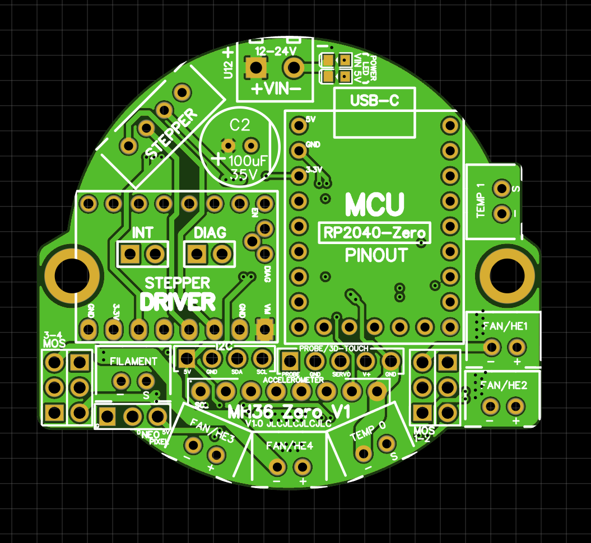
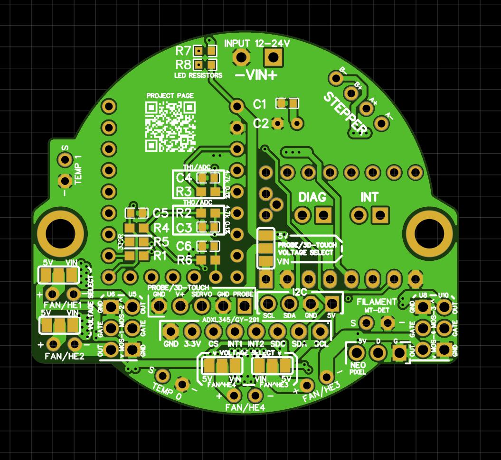

# MH36-Zero V1.0

**Modular toolhead board for Waveshare RP2040-Zero and compatible modules**


Also on [OSHWLab](https://oshwlab.com/kwankiu/rp2040-zero-toolhead)

MH36-Zero is a compact, open-source toolhead board designed for Voron, Rat Rig, and other Klipper-based 3D printers. Built around the Waveshare RP2040-Zero, it is minimalist yet feature-complete: 4 independent fan/heater channels, selectable voltage, StepStick driver socket, ADXL345 breakout, filament detection, probe support, Neopixel, and I2C expansion.

The board is designed to be **cheap and easy to build** — only basic SMD passives are required, and it reuses parts you likely already have (RP2040-Zero, TMC driver, ADXL breakout, NMOS modules, etc.).

## Key Features / Compatibility

- Modular and reusable parts (drawer-friendly)
- Waveshare RP2040-Zero socket
  - Supports RP2040-Zero/Tiny, RP2350-Zero, and pin-compatible modules
  - Cloned RP2040-Zero cost less than $2 (Not tested for reliability, Waveshare board is **recommended**)
- StepStick driver module socket
  - Support TMC2209 (recommended), TMC2208, TMC2240, GC6609, A4988, etc
  - UART and DIAG supported
- 4× independent FAN/HE channels with NMOS headers (GND-GATE-OUT)
  - MOS_VSEL jumper: 5V or VIN selectable
  - Removable NMOS modules (6-pin header)
  - NMOS modules: 40A NMOS module (HYG038N03) from aliexpress/taobao, Mellow Fly VS3622DE (dual-channel), etc.
  - High-current capable (using KF128-2.54-2P connectors, default XH2.54-2P is 3A max)
- ADXL345 (GY-291) breakout socket (SPI + INT)
  - Support I2C and SPI
  - INT1 is connected to GPIO 13 (shared with Probe)
- NTC/PT1000 temperature sensors (2 channels)
  - Support NTC 100K and PT1000 (4.7K pull-up resistor, PT100 not supported)
- Neopixel header
- Probe / 3D-Touch header with servo support
- Filament Detect header (configurable as endstop for homing)
- I2C expansion header (support sensors like AHT20, BME280, LDC1612, Eddy, etc)
- Power input: 12–24V screw terminal (3.81 mm)
- Optional VIN & 5V power LEDs
- M3 mounting holes (43.85 mm diagonal spacing)
  - Fits 36 mm pancake motors, compatible with EBB36 mount
  - Mount: Mini Stealthburner, Anthead, A4T, DragonBurner, G2 and similar toolheads
- Board size: 50.8 × 45.8 mm
- Firmware: Klipper (tested with RP2040-Zero USB connection)

## Pinout & Wiring

**TO BE ADDED**


## PCB
The V1.0 PCB is designed using EasyEDA and is available on OSHWLab, you may also use the exported gerber file in this repo

For JLCPCB, upload the gerber file, and leave the PCB specifications as default
- Cost (5 pcs): $7 (sometimes $2 with offer/coupon)

However, you may want to ensure the following specifications:
- 4-layer PCB
- 1.6mm PCB thickness
- 1oz copper (0.5oz inner)
- Plugged (Via Covering)

Notes: make sure to choose `Order Number(Specify Position)` for JLCPCB, or remove the `JLCJLCJLCJLC` silk label from the PCB File before ordering


Top PCB layout

Bottom PCB layout

## BOM
### Mandatory Components
| Qty | Component                                      | Package / Type              | Notes                                                                                   |
|-----|------------------------------------------------|-----------------------------|-----------------------------------------------------------------------------------------|
| 5   | 100 nF ceramic capacitor                       | 0603                        |                                                                                         |
| 1   | 100 µF (35V) capacitor                         | Through-hole                | 35V or higher, electrolytic or solid, 6.3 mm or 8 mm diameter                           |
| 2   | 2.2 kΩ resistor                                | 0603                        |                                                                                         |
| 2   | 4.7 kΩ (±0.1%) resistor                        | 0603                        | **0.1% tolerance strongly recommended** for accurate temperature readings               |
| 1   | 100 Ω resistor                                 | 0603                        | UART                                                                                    |
| 1   | 330 Ω resistor                                 | 0603                        | or 470 Ω; can be omitted if your Neopixel already includes a 470 Ω series resistor      |
| 1   | 3.81 mm 2-pin screw terminal                   | KF128-3.81-2P or equivalent | For 12-24V Power Input                                                                  |
| 1   | Waveshare RP2040-Zero                          | —                           | or compatible module                                                                    |
| 1   | StepStick driver module                        | —                           | TMC2209, GC6609, A4988, etc.                                                            |
| 1   | NMOS fan/heater driver module                  | —                           | 4× HYG038N03 module **or** 2× Mellow FLY Fan MOS or similar                             |
| —   | 2.54 mm male headers                           | 2.54 mm                     | Various pin counts as needed                                                            |
| —   | 2.54 mm female headers                         | 2.54 mm                     | For RP2040-Zero, StepStick, NMOS 6-pin, ADXL 8-pin                                      |
| 7   | 2.54 mm XH 2-pin connectors                    | XH 2.54 mm                  | Can swap 1–3 with KF128-2.54-2P for FAN/HEATER headers                                  |
| 1   | 2.54 mm XH 4-pin connector                     | XH 2.54 mm                  | Stepper motor connector                                                                 |

### Optional Components
| Qty | Component                                      | Package / Type              | Notes                                                                            |
|-----|------------------------------------------------|-----------------------------|----------------------------------------------------------------------------------|
| 2   | 0603 LED                                       | 0603                        | VIN & 5V power indicators                                                        |
| 1   | 10 kΩ resistor                                 | 0603                        | Current-limiting resistor for VIN LED, use 22 kΩ or higher if too bright         |
| 1   | 2.2 kΩ resistor                                | 0603                        | Current-limiting resistor for 5V LED                                             |
| 1   | ADXL345 module                                 | GY-291 or pin-match         | For input shaping, bed leveling, probing, X/Y homing                             |
| 1   | NTC 100K thermistor                            | Through-hole                | Chamber temperature monitoring                                                   |
| 2   | 2.54 mm jumper / shunt                         | 2.54 mm                     | For enabling INT and DIAG pins (if/when needed)                                  |

## Assembly Guide

1. **Bottom side (SMD)**: Solder all 0603 passives (100nF ×5, 4.7k 0.1% ×2, 2.2k x2, 100Ω, 330Ω and optional LED resistors).
2. **Bottom side (Jumper Pads)**: Solder **all four** Voltage Select jumper pads to your desired operating voltage (Probe/3D Touch, FAN/HE1, FAN/HE2, FAN/HE3, FAN/HE4)
3. **Top side**: Solder headers (2.54 mm), 3.81 mm terminal, 100µF 35V electrolytic (observe polarity!) and all connectors (Optional: Solder LEDs + resistors (VIN LED 10k, 5V LED 2.2k)).
3. **Top side (Jumper Pins)**: Short the INT and DIAG enable jumpers if the feature is needed
4. **Plug-ins**:
   - Waveshare RP2040-Zero module
   - TMC driver module
   - NMOS modules
   - ADXL module (optional)
5. **GND enhancement for high sustained load (optional)**:
   - Solder a **18 AWG or thicker** wire between the two GND pins on the TMC/StepStick module (or the bottom of the PCB)
   - This is discovered during a LED resistor routing which generated a narrow ground plane path causing the ground to flow through the TMC/StepStick Module instead of the ground plane as return path (fixed in the final V1.0 PCB file, therefore **not necessary**), but may help reduces heat and allows better ground return under sustained high loads

## Klipper Configuration

See `firmware/klipper_config/MH36Zero.cfg` in this repo for pin example.

```ini
## Toolhead Board
##--------------------------------------------------------------------
[mcu thb]
## For USB
##	Obtain definition by "ls /dev/serial/by-id/*" then unplug to verify
serial: /dev/serial/by-id/{REPLACE WITH YOUR SERIAL}
restart_method: command

#######
# MCU #
#######

# MH36 Zero
[include MH36Zero.cfg]
```
See `firmware/klipper_config/example.cfg` in this repo for detailed example.

## Safety & Warnings

- No overcurrent/short-circuit protection on VIN — use fused/current-limited PSU, never plug/unplug wires live.
- No reverse polarity protection — double-check VIN + – wiring before power-up (reverse may damage USB host via GND back door).
- Hand-assembly **required** — solder carefully, check for bridges.

## License
- GPL GNU v3 License — feel free to fork, modify, and share.

## Credits
- Designed by kwankiu (Samuel)
- Inspired by EBB36, SHT36, NH36, THR36, and other open-source toolheads