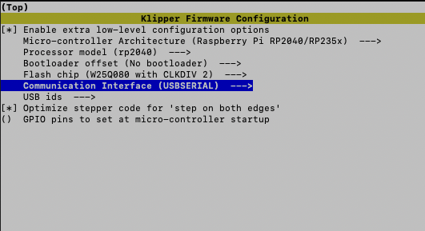

# Firmware Guide

This folder contains pre-built firmware binaries and example Klipper configurations for the MH36-Zero (based on Waveshare RP2040-Zero or compatible RP2040 module).

## Directory

| Item                              | Purpose                                                                 | How to Use |
|-----------------------------------|-------------------------------------------------------------------------|------------|
| `klipper_config`          | Klipper pinout and configurations  | / |
| `klipper_rp2040_usb.uf2`          | Klipper firmware for **direct USB** connection (no bootloader offset)  | Drag-and-drop to RPI-RP2 drive (BOOTSEL mode) for simple USB MCU setup |
| `klipper_rp2040_usb_16k_offset.bin` | Klipper firmware compiled with **16 KiB bootloader offset** (for Katapult) | Used after flashing Katapult; update via Katapult tools (e.g. make flash or scripts) |
| `katapult_rp2040_usb.uf2`             | Katapult bootloader for RP2040 – USB connection | Initial flash via drag-and-drop; allows remote Klipper updates |

## Flashing Pre-built Firmware

### 1. Direct USB Klipper

1. Hold the **BOOT** button on the RP2040-Zero (or your board's equivalent).
2. Connect USB cable to your computer/host → it mounts as a mass-storage device named **RPI-RP2**.
3. Copy `klipper_rp2040_usb.uf2` to the drive root.
4. The board auto-reboots (drive ejects) → Klipper MCU is now running over USB.
5. Find the serial device and update your `printer.cfg` accordingly:
   ```bash
   ls /dev/serial/by-id/*
   ```

### 2. Using Katapult (USB)

Tips: You may want to try this if your board does not boot anymore after disconnecting/reconnecting.

1. Hold the **BOOT** button on the RP2040-Zero (or your board's equivalent).
2. Connect USB cable to your computer/host → it mounts as a mass-storage device named **RPI-RP2**.
3. Copy `katapult_rp2040_usb.uf2` to the drive root.
4. The board auto-reboots (drive ejects) → Board reboots into Katapult bootloader mode.
5. Find the serial device, look for something like `usb-katapult_rp2040_xxxxx-if00`:
   ```bash
   ls /dev/serial/by-id/*
   ```
6. Flash the klipper firmware (`klipper_rp2040_usb_16k_offset.bin`) using Katapult Flash Tool:
   ```bash
   python3 ~/katapult/scripts/flashtool.py -d /dev/serial/by-id/usb-katapult_rp2040_xxxxx-if00 -f klipper_rp2040_usb_16k_offset.bin
   ```
7. Don't forget to update your `printer.cfg` accordingly.

## Compile Firmware

Run the following command:
```
cd ~/klipper
make menuconfig
```

Klipper Configuration for RP2040-Zero with USB connection:



Tips: Set `Bootloader offset (16KiB bootloader)` to compile for Katapult

Enter `q` then save and run `make` to compile klipper firmware

